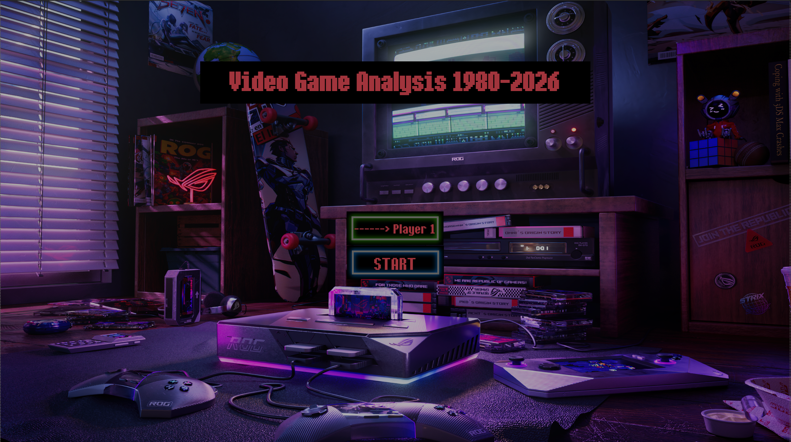
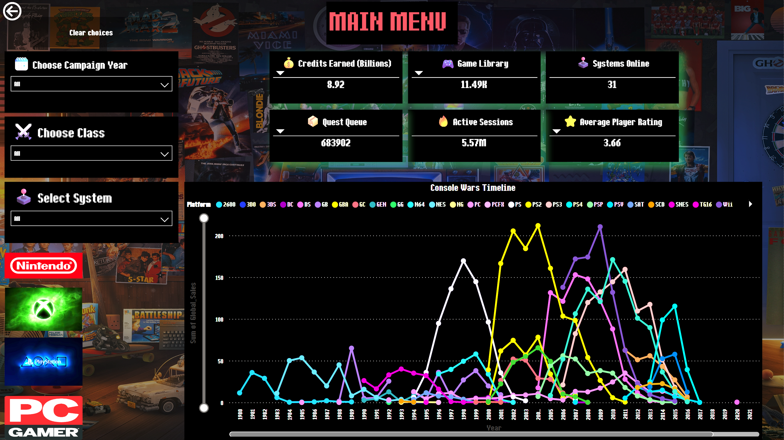
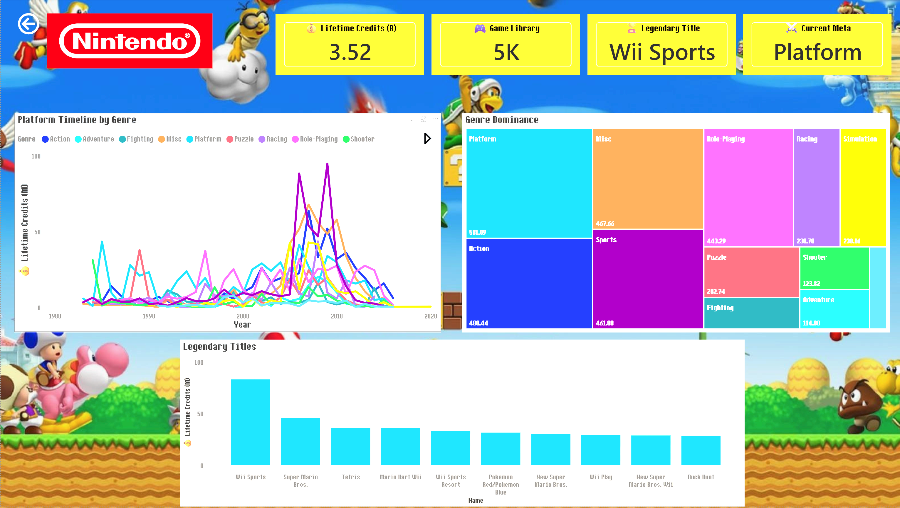
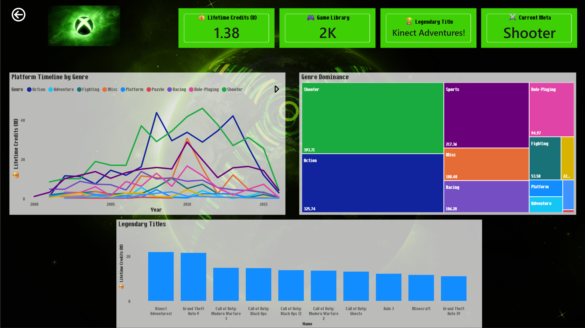
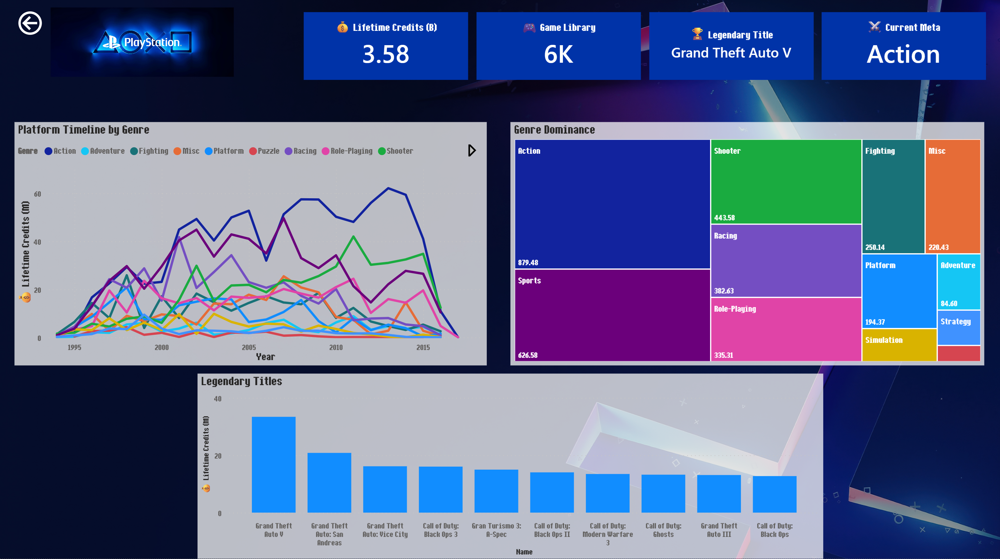
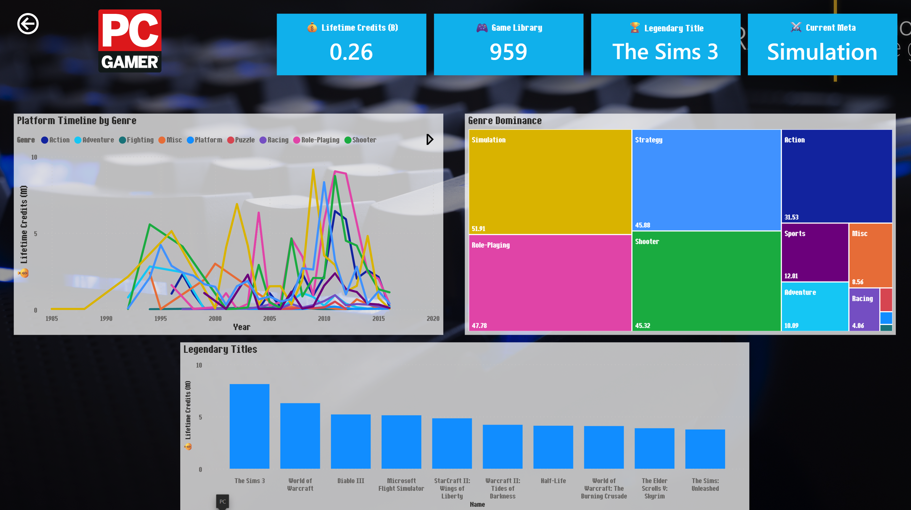
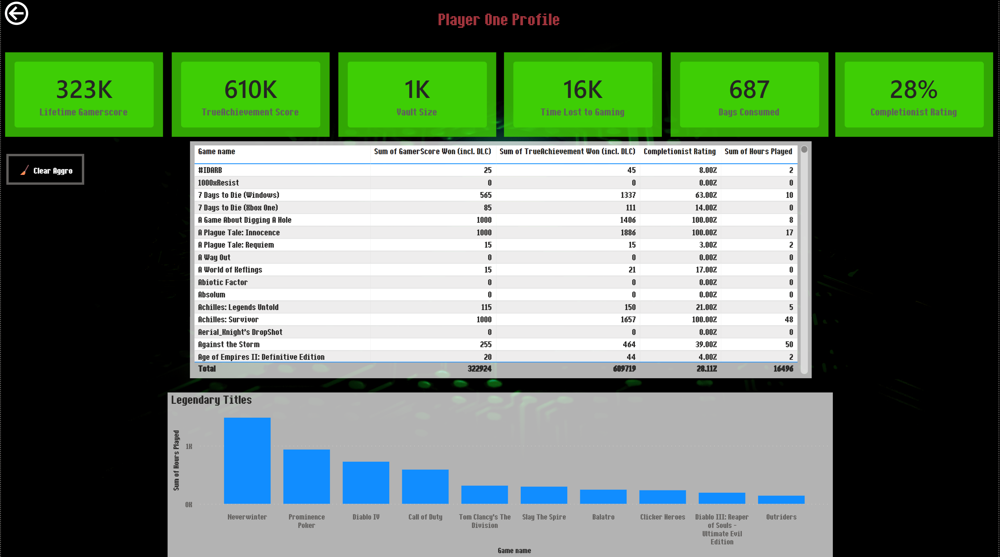
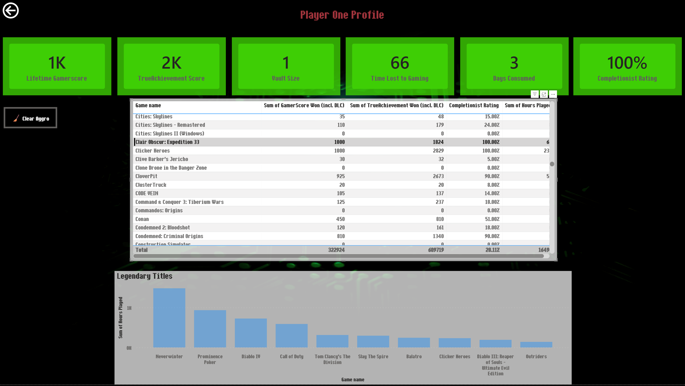
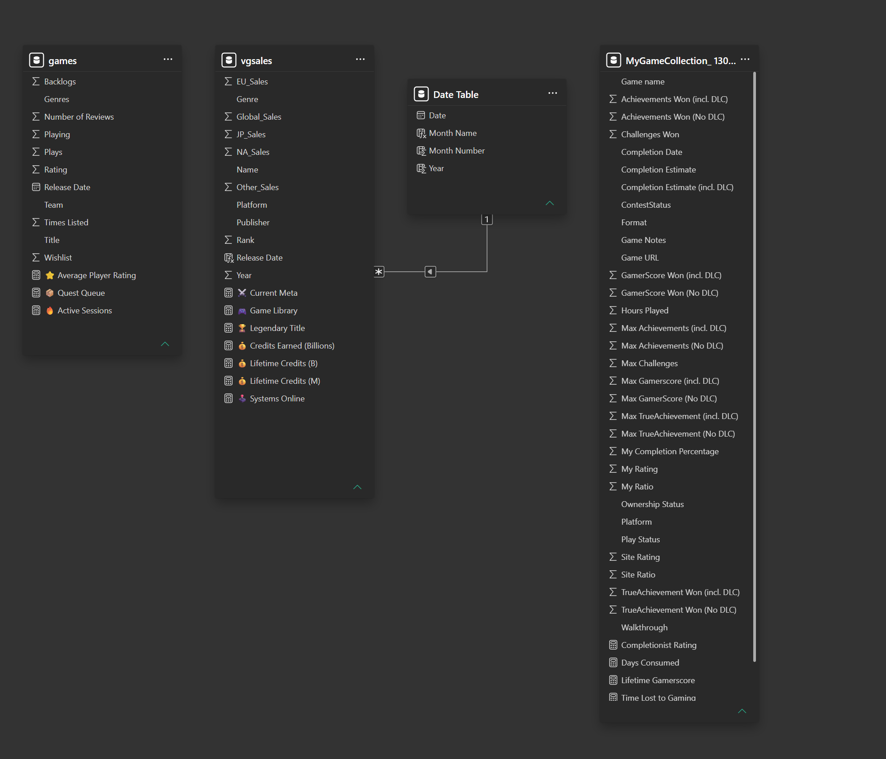

# 🎮 Video Game Market Analysis | Power BI

An interactive Power BI analytics experience exploring video game sales,
platform performance, genre trends, and personal gaming statistics.



## 📊 Project Overview

This project was developed as a Power BI capstone focused on combining
data analysis, visualization, data modeling, and storytelling within an
interactive report.

Rather than designing the project as a traditional business dashboard,
I built the report around the visual language of a video game. Users enter
through a Start Menu and navigate to an interactive Main Menu where they
can explore the video game market across Nintendo, Xbox, PlayStation,
and PC.

The project also incorporates personal gaming data through a dedicated
Player One Profile, providing a second analytical perspective focused on
player behavior, achievements, completion, and playtime.



---

## 🎯 Project Goals

The project was designed to answer questions such as:

- How has the video game market changed over time?
- How do Nintendo, Xbox, PlayStation, and PC compare?
- Which genres dominate individual gaming platforms?
- Which titles have generated the greatest lifetime performance?
- How has genre popularity changed across different generations?
- What patterns can be identified within an individual player's gaming history?
- How can Power BI navigation and visual design be used to create an
  interactive storytelling experience?

---

## 🛠️ Technologies & Skills

| Technology / Skill | Application |
|---|---|
| Power BI Desktop | Report development and interactive visualization |
| Power Query | Data preparation and transformation |
| DAX | Measures, KPIs, and analytical calculations |
| Data Modeling | Relationships and dedicated date dimension |
| Data Visualization | Trends, rankings, KPIs, and genre analysis |
| Interactive Navigation | Menu-driven report navigation |
| JSON | Custom Power BI report theme |
| Data Storytelling | Converting analysis into a themed user experience |

---

## 🕹️ Interactive Main Menu

The Main Menu serves as the central navigation and analysis hub for the
report.

Users can filter the analysis by campaign year, class, and gaming system
while viewing high-level metrics and a timeline comparing platform
performance.

Key metrics presented on the Main Menu include:

- Credits Earned
- Game Library
- Systems Online
- Quest Queue
- Active Sessions
- Average Player Rating

The gaming terminology was intentionally used to integrate analytical
metrics into the overall theme of the report.


---

# 🎮 Platform Analysis

Dedicated report pages provide deeper analysis for the major gaming
platform ecosystems.

Each page maintains a common analytical structure while using
platform-specific visual design.

The platform dashboards include:

- Lifetime Credits
- Game Library Size
- Legendary Title
- Current Meta
- Platform Timeline by Genre
- Genre Dominance
- Highest-performing titles

## 🔴 Nintendo

The Nintendo dashboard analyzes the company's game catalog and historical
genre performance.



## 🟢 Xbox

The Xbox dashboard provides the same analytical framework while adapting
the report's visual identity to the Xbox ecosystem.



## 🔵 PlayStation

The PlayStation dashboard explores historical performance, genre
distribution, and leading titles within the PlayStation ecosystem.



## 🖥️ PC

The PC dashboard applies the analysis to PC gaming, highlighting differences
in genre distribution and leading titles compared with console platforms.



---

# 👤 Player One Profile

The Player One Profile shifts the analysis from the overall video game
market to my own Xbox gaming history.

At the lifetime level, the dashboard calculates:

- Lifetime Gamerscore
- TrueAchievement Score
- Game Library Size
- Total Hours Played
- Days Consumed
- Completionist Rating

### Lifetime Player Profile

By default, the page provides a complete view of my lifetime Xbox gaming
statistics and game history.



### 🎯 Interactive Game Profiles

The game table is more than a list of titles. Selecting an individual game
changes the filter context of the dashboard and dynamically updates the
profile metrics to represent that specific title.

This allows the same report page to function as both a lifetime player
profile and an individual game profile without requiring the user to
navigate to another page.



The **Clear Aggro** button removes the game selection and restores the
dashboard to the lifetime player view.

The feature was intentionally wrapped in the terminology and visual style
of the project so that Power BI's interactive filtering became part of the
gaming experience rather than feeling like a traditional dashboard control.

---

# 📦 Data Sources

This project combines a public video game dataset with personal Xbox gaming
data to provide two different analytical perspectives: industry-level video
game analysis and individual player analysis.

## 🎮 Video Game Sales & Engagement Data

The primary market and game library data used in this project comes from the
**Video-Game-Sales-and-Engagement-Analysis** dataset available on Kaggle.

**Source:**  
[Video-Game-Sales-and-Engagement-Analysis - Kaggle](https://www.kaggle.com/datasets/bimalkumarsaini/video-game-sales-and-engagement-analysis)

The dataset provided the foundation for the `vgsales` and `games` tables used
throughout the Power BI model.

These data were used to explore:

- Video game sales over time
- Platform performance
- Genre distribution
- Individual game performance
- Differences between Nintendo, Xbox, PlayStation, and PC
- Changes in genre popularity across gaming generations

## 👤 Personal Xbox Gaming Data

The Player One Profile incorporates my personal Xbox gaming history to add
a second, player-level analytical perspective to the project.

**Source:**  
[My Game Collection - TrueAchievements](https://www.trueachievements.com/gamer/curse1/gamecollection)

The data from my TrueAchievements game collection was used to support
game-level and lifetime metrics including:

- Gamerscore
- TrueAchievement Score
- Achievements earned
- Completion percentage
- Hours played
- Game library size
- Lifetime gaming statistics

This data was intentionally incorporated as a personal "Easter egg" within
the larger video game market analysis.

Selecting an individual game changes the dashboard's filter context and
dynamically updates the Player One metrics for that title. Selecting
**Clear Aggro** removes the game selection and restores the lifetime player
statistics.

The raw personal gaming dataset is not distributed with this repository.
The original collection can be viewed through the TrueAchievements source
linked above.

---

# 🗃️ Data Model

The report combines multiple datasets serving different analytical
purposes, including video game information, sales information, and
personal gaming statistics.

A dedicated Date Table supports temporal analysis and provides fields
including date, month, and year.



The model supports calculations and measures used throughout the report,
including:

- Average Player Rating
- Active Sessions
- Quest Queue
- Game Library
- Systems Online
- Credits Earned
- Lifetime Credits
- Legendary Title
- Current Meta
- Completionist Rating
- Lifetime Gamerscore
- Days Consumed
- Time Lost to Gaming

---

# 🎨 Report Design

Visual design was treated as part of the analytical experience rather
than simply decoration.

The report uses a custom gaming-inspired interface with:

- A video game-style Start Menu
- Menu-based navigation
- Platform-specific backgrounds and branding
- Consistent dashboard layouts between platforms
- Gaming terminology for analytical KPIs
- A custom Power BI JSON theme

The custom theme is included in:

`theme/Theme.json`

This approach allowed the report to retain a consistent analytical
structure while giving each section its own visual identity.

---

# 📁 Repository Structure

```text
video-game-market-analysis-power-bi/
│
├── README.md
│
├── dashboard/
│   └── Allen_Potts_PowerBI_Capstone.pbix
│
├── docs/
│   ├── data-model.png
│   └── Microsoft-Power-BI-Storytelling.pptx
│
screenshots/
├── 01-start-menu.png
├── 02-main-menu.png
├── 03-nintendo.png
├── 04-xbox.png
├── 05-playstation.png
├── 06-pc.png
├── 07-player-one-profile.png
└── 08-player-one-game-selected.png  
│
└── theme/
    └── Theme.json
```

---

# 🚀 Running the Project

To explore the complete interactive report:

1. Download the `.pbix` file from the `dashboard` directory.
2. Open the file using Microsoft Power BI Desktop.
3. Begin at the Start Menu.
4. Select **START** to enter the report.
5. Navigate between the Main Menu, platform dashboards, and Player One Profile.
6. Use the available filters and interactive visuals to explore the data.

> Power BI Desktop is required to open the `.pbix` file.

---

# 💡 What I Learned

The biggest challenge of this project wasn't necessarily working with the
data itself. It was taking everything I had learned throughout the course
and combining it into a complete Power BI presentation.

The project pushed me to think beyond whether a calculation or visualization
was technically correct. I had to think about the experience of the person
using the report:

- Is the information clear?
- Is the layout intuitive?
- Does a visualization communicate something useful, or does it make the
  analysis more confusing?
- Can the report be visually interesting without distracting from the data?
- How can multiple report pages feel like parts of the same experience?

Using video game data gave me a subject I genuinely enjoyed exploring and
allowed me to have fun with those decisions. Rather than creating a
traditional dashboard, I leaned into the gaming theme and experimented with
navigation, terminology, backgrounds, platform-specific designs, and
interactive elements.

There are still visual and layout decisions I would approach differently
today, and there is more I would like to explore with the report. However,
I am proud of the final product because it represents the point where the
individual Power BI concepts I had learned began to come together as a
complete analytical experience.

## 🎮 A Personal Easter Egg

One of my favorite additions was incorporating my own Xbox gaming history
into the **Player One Profile**.

The page begins by showing my lifetime gaming statistics. Selecting an
individual game dynamically changes the profile metrics to reflect the
statistics for that specific title.

Selecting **Clear Aggro** removes the game selection and restores the
dashboard to the lifetime player view.

This started as a fun personal addition to the project, but it also became
a practical demonstration of Power BI's interactive filtering and dynamic
report context.

---

## 📄 Additional Documentation

The original Power BI storytelling presentation is available in:

`docs/Microsoft-Power-BI-Storytelling.pptx`

The complete Power BI report is available in:

`dashboard/Allen_Potts_PowerBI_Capstone.pbix`

---

## 👨‍💻 Author

**Craig Allen Potts**

Data Engineering • Business Intelligence • Software Engineering
